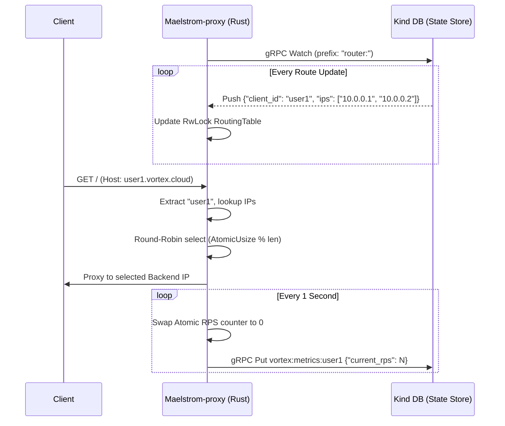

<p align="center">
  
</p>

<p align="center">
  <b>A high-performance, stateless L7 Edge Router for the Vortex PaaS.</b><br/>
  Built with Rust, Cloudflare's Pingora, and Tokio — fully event-driven via Kind DB.
</p>

<p align="center">
  
  
  
  
  
  
</p>

---

## What is Maelstrom-proxy?

Maelstrom-proxy is the data-plane ingress point for the Vortex container orchestration platform. It is a strictly **stateless edge router** designed to handle extreme throughput and instantaneous dynamic re-routing without reloading configuration files.

Adhering to the **"Vortex Way"**, the router holds absolutely zero local state. It maintains an in-memory `Arc<RwLock>` routing table that is updated in sub-milliseconds exclusively via gRPC server-sent **Watch** streams from [Kind DB](https://github.com/NKS01X/Kind). Concurrently, it streams real-time telemetry (RPS metrics) back to Kind DB via gRPC **Put** requests, effectively feeding the distributed auto-scaler without relying on traditional Prometheus scraping.

---

## Architecture


---

## How it works



1. **Continuous Watch**: A background Tokio task opens a gRPC Watch stream to Kind DB, listening for changes to backend IP allocations under the `router:` prefix.
2. **Stateless Routing**: When a request arrives, Pingora extracts the `client_id` from the HTTP `Host` header, performs a lock-free lookup in the routing table, and routes the request using an atomic Round-Robin counter.
3. **Event-Driven Telemetry**: Every second, a separate Tokio task harvests the RPS counters for all active clients and flushes them to `vortex:metrics:<client_id>` in Kind DB. This triggers the Vortex Daemon to automatically scale containers up or down.

---

## Key Features

| Feature | Description |
|---|---|
| **Zero-Downtime Re-Routing** | Backend IP lists are synchronized over gRPC streams. No config reloads, no Nginx `SIGHUP` — new containers receive traffic instantly. |
| **High-Performance Proxy** | Powered by Cloudflare's **Pingora** framework, written in memory-safe Rust for maximum throughput and minimal tail latency. |
| **Lock-Free Metrics Harvesting** | RPS tracking is done via `AtomicUsize`. A background thread safely swaps the counter to `0` every second without blocking the hot path. |
| **Round-Robin Load Balancing** | Distributes traffic evenly across all healthy backends using an atomic increment counter modulo the backend pool size. |
| **Event-Driven Auto-Scaling** | Feeds the Vortex control plane directly by pushing metrics to Kind DB, eliminating latency caused by Prometheus metric scraping intervals. |

---

## Getting Started

### Prerequisites

- Rust (Edition 2021)
- `protoc` (Protocol Buffers Compiler required for `tonic-build`)
  - Ubuntu/Debian: `sudo apt-get install protobuf-compiler`
- A running instance of **Kind DB** on `localhost:50051`

### Running the Router

```bash
# Clone the repository
git clone https://github.com/NKS01X/Maelstrom-proxy.git
cd Maelstrom-proxy

# Build and run the Pingora server
cargo run --release
```

The router will bind its HTTP proxy service to `0.0.0.0:8000` and immediately connect to Kind DB to initialize its routing state.

---

## Project Structure

```
Maelstrom-proxy/
│
├── src/
│   └── main.rs                  # Pingora server, ProxyHttp trait, Tokio tasks
│
├── proto/
│   └── kind.proto               # Kind DB gRPC Service Definitions
│
├── build.rs                     # tonic-build proto compiler script
├── Cargo.toml                   # Rust dependencies (Pingora, Tokio, Tonic, Serde)
└── README.md                    # You are here
```

---

## License

MIT

---

<div align="center">
  Built by <b>Nikhil</b> &nbsp;·&nbsp; Powered by <a href="https://github.com/cloudflare/pingora"><b>Pingora</b></a> &nbsp;·&nbsp; Component of <a href="https://github.com/NKS01X/Vortex"><b>Vortex</b></a>
</div>
