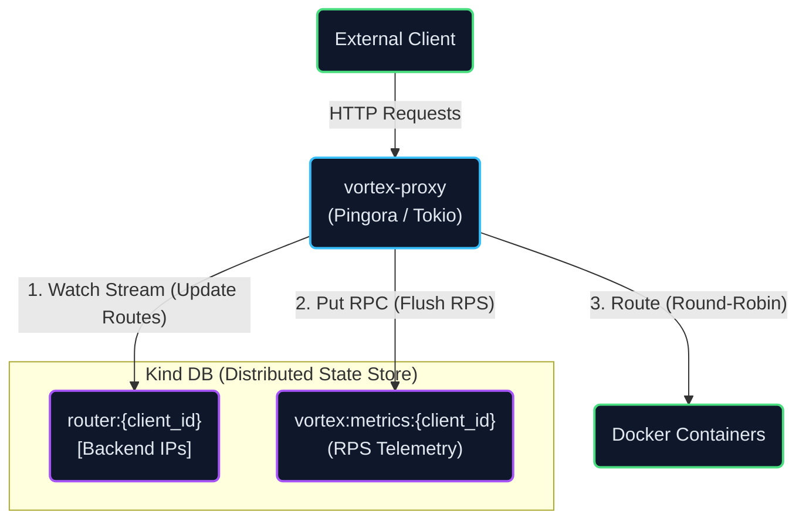
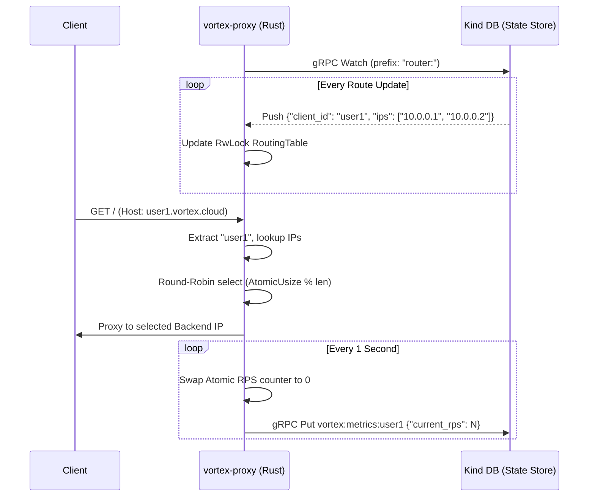

<p align="center">
  
</p>

<p align="center">
  <b>A high-performance, stateless L7 Edge Router for the Vortex Engine.</b><br/>
  Built with Rust, Cloudflare's Pingora, and Tokio — fully event-driven via Kind DB.
</p>

<p align="center">
  
  
  
  
  
  
  
</p>

---

## What is vortex-proxy?

Vortex-proxy is the data-plane ingress point for the Vortex container orchestration platform. It is a strictly **stateless edge router** designed to handle extreme throughput and instantaneous dynamic re-routing without reloading configuration files.

Adhering to the **"Vortex Way"**, the router holds absolutely zero local state. It maintains an in-memory `Arc<RwLock>` routing table that is updated in sub-milliseconds exclusively via gRPC server-sent **Watch** streams from [Kind DB](https://github.com/NKS01X/Kind). Concurrently, it streams real-time telemetry (RPS metrics) back to Kind DB via gRPC **Put** requests, effectively feeding the distributed auto-scaler without relying on traditional Prometheus scraping.

---

## Architecture & Design Philosophy

The core philosophy of vortex-proxy is to separate the *data plane* (routing traffic) from the *control plane* (deciding where traffic goes). Because the proxy is entirely stateless, it can crash, restart, or horizontally scale without losing any critical cluster data—everything lives in Kind DB.



### Event-Driven Flow

To understand the asynchronous event-driven design, the "hot path" (handling HTTP requests) is completely decoupled from the background tasks (updating routes and flushing metrics).



1. **Continuous Watch**: A background Tokio task opens a gRPC Watch stream to Kind DB, listening for changes to backend IP allocations under the `router:` prefix.
2. **Stateless Routing**: When a request arrives, Pingora extracts the `client_id` from the HTTP `Host` header, performs a lock-free lookup in the routing table, and routes the request using an atomic Round-Robin counter.
3. **Event-Driven Telemetry**: Every second, a separate Tokio task harvests the RPS counters for all active clients and flushes them to `vortex:metrics:<client_id>` in Kind DB. This triggers the Vortex Daemon to automatically scale containers up or down.

---

## Key Features

* **Zero-Downtime Re-Routing:** Backend IP lists are synchronized over gRPC streams. No config reloads, no Nginx `SIGHUP` — new containers receive traffic instantly.
* **High-Performance Proxy:** Powered by Cloudflare's Pingora framework, written in memory-safe Rust for maximum throughput and minimal tail latency.
* **Lock-Free Metrics Harvesting:** RPS tracking is done via `AtomicUsize`. A background thread safely swaps the counter to `0` every second without blocking the hot path.
* **Round-Robin Load Balancing:** Distributes traffic evenly across all healthy backends using an atomic increment counter modulo the backend pool size.
* **Event-Driven Auto-Scaling:** Feeds the Vortex control plane directly by pushing metrics to Kind DB, eliminating latency caused by Prometheus metric scraping intervals.

---

## Environment Setup & Prerequisites

Before running the proxy, ensure your system has the correct toolchain and dependencies installed.

1. **Rust:** Standard Rust toolchain (Edition 2021).
   ```bash
   curl --proto '=https' --tlsv1.2 -sSf [https://sh.rustup.rs](https://sh.rustup.rs) | sh
   ```
2. **Protocol Buffers (`protoc`):** Required by `tonic-build` to compile the gRPC definitions.
   * Ubuntu/Debian: `sudo apt-get install protobuf-compiler`
   * macOS: `brew install protobuf`
3. **Docker:** Required to spin up Kind DB and backend servers.
4. **gRPCurl:** Required to manually inject data into Kind DB.
   * Install via Go: `go install github.com/fullstorydev/grpcurl/cmd/grpcurl@latest`

### Configuration

Vortex-proxy uses environment variables for configuration to ensure 12-factor app compliance.

* `KIND_DB_URL` (Default: `http://localhost:50051`) - The gRPC endpoint for the Kind DB state store.
* `RUST_LOG` (Default: `info`) - Logging level (`debug`, `info`, `warn`, `error`).

---

## Running the Cluster (Local Development)

To see the proxy route traffic, we need to create a local mini-cluster.

### Recommended Way (Automated)
*Pre-requisite: The system should have Perl installed.*

**1. Make the script executable**
Before running the automated cluster setup, you must give the file permission to execute on your machine.
```bash
chmod +x setup_cluster.pl 
```

**2. Run the script**
```bash
./setup_cluster.pl 
```

### Alternate Way (Manual)
**1. Create a dedicated Docker network**
```bash
docker network create vortex-net
```

**2. Start the Backend Containers**
Spin up two simple Nginx containers to act as the user application.
```bash
docker run -d --name backend-1 -p 8081:80 --network vortex-net nginxdemos/hello:plain-text
docker run -d --name backend-2 -p 8082:80 --network vortex-net nginxdemos/hello:plain-text
```

**3. Start Kind DB (The Control Plane)**
```bash
docker run -d --name kind-db -p 50051:50051 --network vortex-net nks01x/kind-db:latest
```

**4. Start vortex-proxy**
```bash
git clone [https://github.com/NKS01X/vortex-proxy.git](https://github.com/NKS01X/vortex-proxy.git)
cd vortex-proxy

export KIND_DB_URL="http://localhost:50051"
export RUST_LOG="info"
cargo run --release
```
*The proxy is now running on port 8000. Leave this terminal open.*

---

## Simulating Traffic & Dynamic Routing

Because vortex-proxy is completely stateless, it boots up with an **empty** routing table. Follow these steps to see the real-time gRPC stream in action.

**1. Test the "Cold" State**
Open a new terminal and attempt to route traffic for `testapp`:
```bash
curl -i -H "Host: testapp.vortex.cloud" http://localhost:8000
```
*Result: 502 Bad Gateway. The proxy correctly drops the request because the routing table is empty.*

**2. Inject the Route via gRPC**
We will inject a base64 encoded JSON payload into Kind DB: `{"client_id": "testapp", "ips": ["127.0.0.1:8081", "127.0.0.1:8082"]}`.
```bash
grpcurl -plaintext -import-path ./proto -proto kind.proto \
  -d '{"key": "router:testapp", "value": "eyJjbGllbnRfaWQiOiAidGVzdGFwcCIsICJpcHMiOiBbIjEyNy4wLjAuMTo4MDgxIiwgIjEyNy4wLjAuMTo4MDgyIl19"}' \
  localhost:50051 kind.KindService/Put
```
*Kind DB receives the data and instantly pushes it down the Watch stream to the Rust proxy, updating its memory without a restart.*

**3. Test the "Hot" State (Live Routing)**
Run the exact same curl command again:
```bash
curl -i -H "Host: testapp.vortex.cloud" http://localhost:8000
```
*Result: HTTP 200 OK. The proxy is now seamlessly load-balancing between your two local Nginx containers.*

---

## Observing Telemetry

While you fire requests, the proxy's background Tokio thread counts them and flushes the Requests Per Second (RPS) back to Kind DB every 1 second. 

To view the real-time telemetry being reported for your client, query Kind DB directly:
```bash
grpcurl -plaintext -import-path ./proto -proto kind.proto \
  -d '{"key": "vortex:metrics:testapp"}' \
  localhost:50051 kind.KindService/Get
```

---

## Running via Docker (Production)

To run the proxy in a production container, use the included multi-stage `Dockerfile`. It compiles a minimal, standalone binary based on Debian Bookworm.

```bash
docker build -t vortex-proxy:latest .

docker run -d \
  --name proxy \
  --network vortex-net \
  -p 8000:8000 \
  -e KIND_DB_URL="http://kind-db:50051" \
  vortex-proxy:latest
```

---

## CI/CD & End-to-End Testing

This project utilizes GitHub Actions to ensure strict quality control and functional correctness on every commit and pull request. 

The primary workflow (`integration-tests.yml`) executes the following:
1. **Code Quality:** Enforces formatting standards (`cargo fmt`) and pedantic linting rules (`cargo clippy`).
2. **Release Compilation:** Builds the proxy and its dependencies from scratch.
3. **Ephemeral Test Environment:** Automatically provisions a local Docker network, spins up Kind DB, and starts two Nginx backend containers.
4. **Live gRPC Injection:** Uses `grpcurl` to push base64 routing payloads directly to the test DB.
5. **E2E Routing Verification:** Boots the proxy locally, fires HTTP requests at it, and strictly asserts an HTTP 200 response to guarantee that dynamic routing over gRPC is functioning properly.
6. **Log Archival:** Uploads the proxy's `stdout` and `stderr` logs as GitHub Artifacts upon completion for trace debugging.

---

## Project Structure

```text
vortex-proxy/
│
├── src/
│   └── main.rs                  # Pingora server, ProxyHttp trait, Tokio tasks
│
├── proto/
│   └── kind.proto               # Kind DB gRPC Service Definitions
│
├── Dockerfile                   # Multi-stage optimized Rust build
├── setup_cluster.pl             # Perl automation script for local environments
├── build.rs                     # tonic-build proto compiler script
├── Cargo.toml                   # Rust dependencies (Pingora, Tokio, Tonic, Serde)
└── README.md                    # You are here
```

---

## License

MIT

---

<div align="center">
  Built by <b>Nikhil</b> &nbsp;·&nbsp; Powered by <a href="https://github.com/cloudflare/pingora"><b>Pingora</b></a> &nbsp;·&nbsp; Component of <a href="https://github.com/NKS01X/Vortex"><b>Vortex</b></a> &nbsp;·&nbsp; Utilises of <a href="https://github.com/NKS01X/kind-db"><b>Kind-db</b></a>
</div>